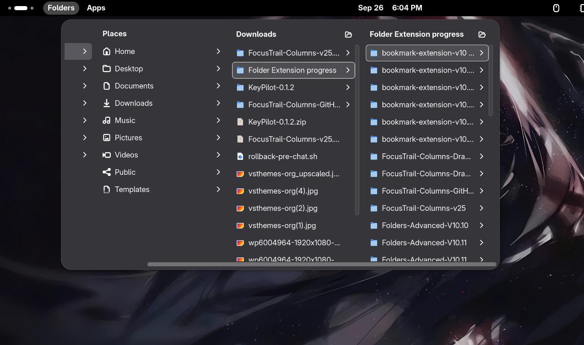
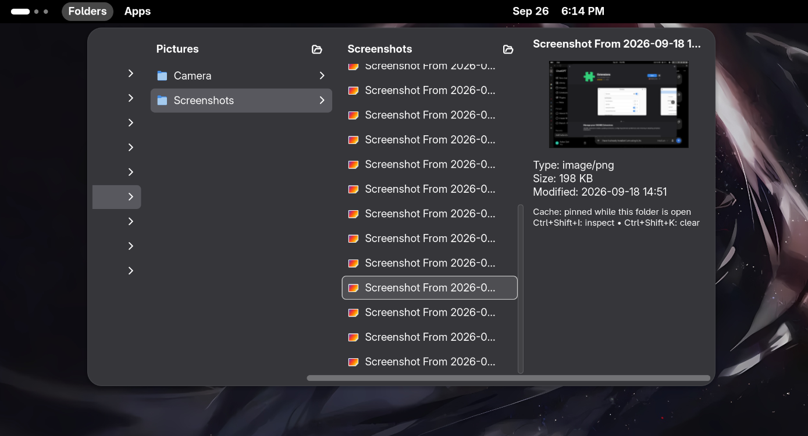
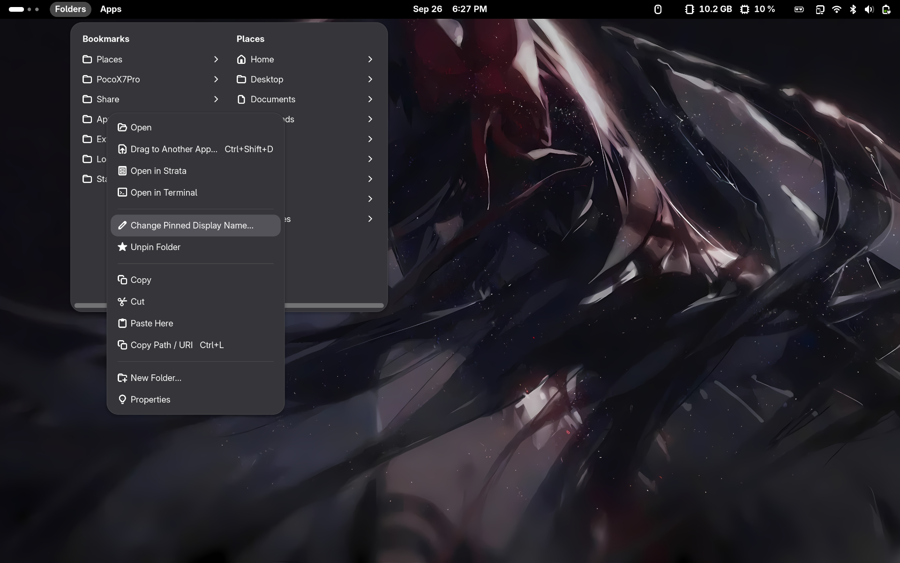
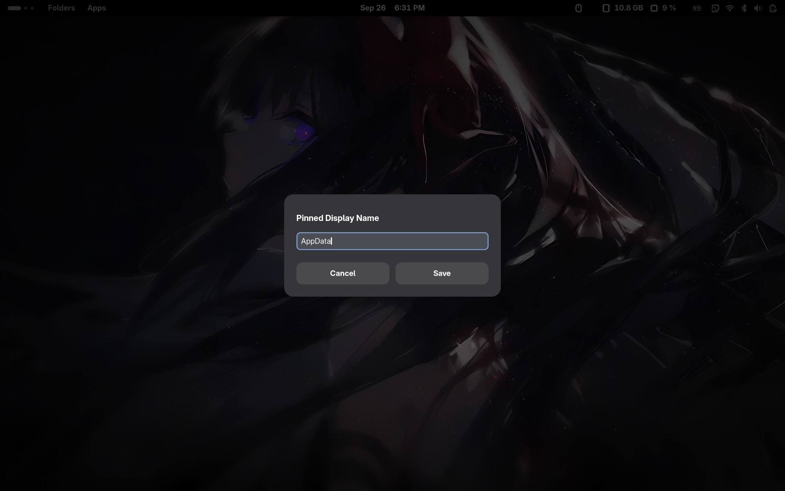
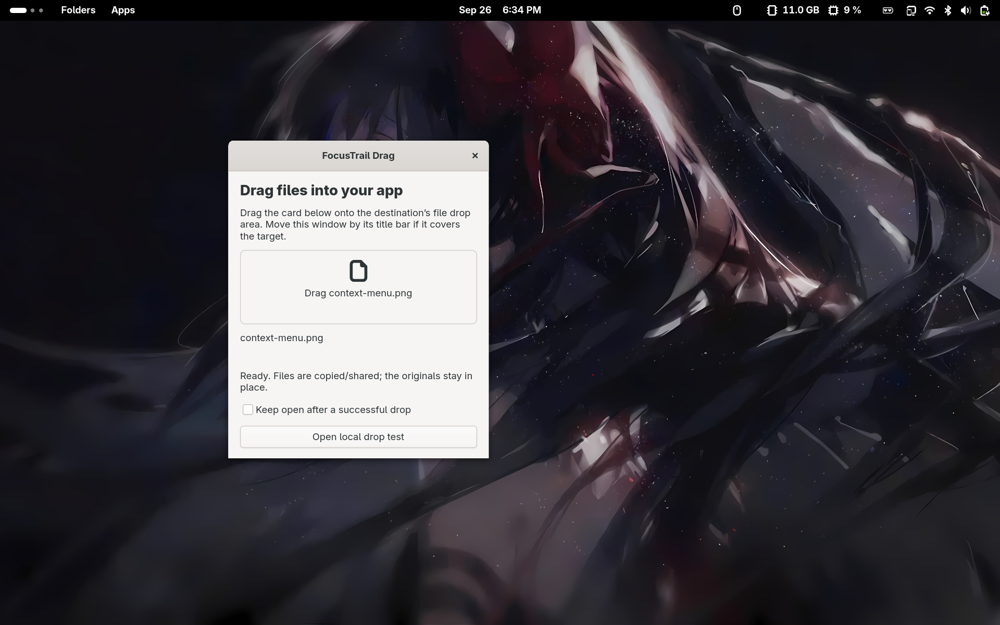
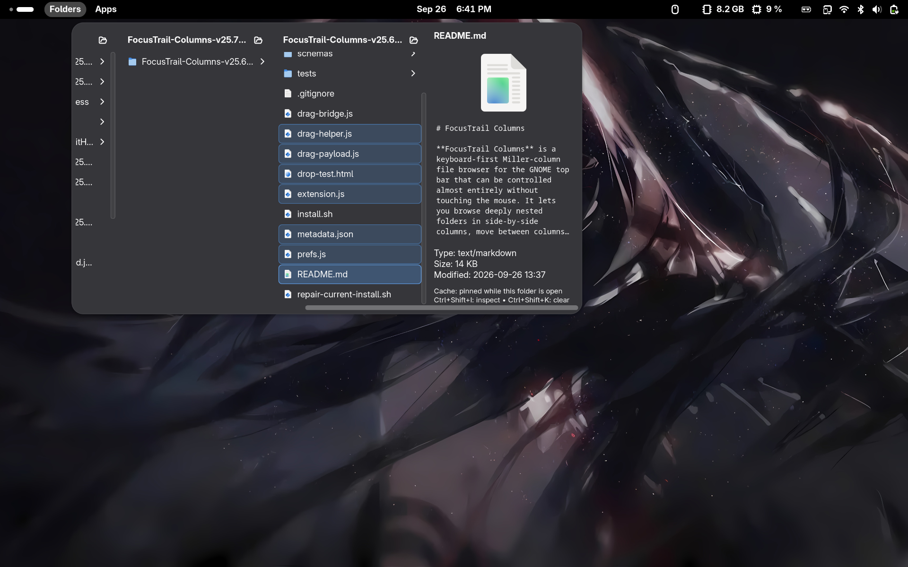

# FocusTrail Columns

**FocusTrail Columns** is a keyboard-first Miller-column file browser for the GNOME top bar that can be controlled almost entirely without touching the mouse. It lets you browse deeply nested folders in side-by-side columns, move between columns with the keyboard, preview images and supported files inline, perform copy/cut/paste/rename/delete operations, drag files into other applications through a native GTK drag window, use smooth opening/closing and viewport animations, cache previews for faster browsing, pin folders and give those pins custom display names, sort folders persistently, and quickly open any item in the system file manager when needed. The browser is designed to keep navigation fast and visible: focus follows your keyboard movement, previews act as inspectors rather than navigation stops, and open folder paths remain laid out as a Miller-column trail.

## Screenshots

> Put the screenshots in `assets/screenshots/` using the exact filenames shown below. Once the files are there, GitHub will display them automatically in this README.

### Folder menu and Miller-column navigation



The main menu starts from your pinned/bookmarked locations and opens nested folders as side-by-side Miller columns. You can move through rows and columns entirely with the keyboard, while smooth viewport transitions keep the active column visible as the path gets deeper.

### Image and file preview



Focusing or hovering a supported file can open an inline preview without leaving the folder browser. Previews are treated as inspectors rather than normal columns, so keyboard navigation can continue directly between the parent and child folder columns.

### Right-click context menu



The context menu exposes actions such as open, rename, copy/cut, paste, delete, extract, pin/unpin, sort, properties, copy path, open in terminal, and open in the system file manager. The available actions adapt to the item that is currently focused or selected.

### Custom names for pinned folders



Pinned folders can be given a custom **display name** without renaming the real directory on disk. This is useful for shortening long paths, labeling remote folders, or giving bookmarks friendlier names while keeping the underlying folder untouched.

### Native drag-and-drop window



Press **Ctrl + Shift + D** or choose **Drag to Another App…** to open the native FocusTrail Drag window for the focused file or current multi-selection. Press and hold the file card, drag it onto another application or browser drop target, and release; the helper provides real native file/URI data instead of merely pasting a filename.

The drag helper uses a separate GTK window because GNOME Shell menu rows cannot reliably continue the same pointer drag directly into another application. Successful drops close the helper automatically unless **Keep open after a successful drop** is enabled, while cancelled or rejected drops leave it available so you can try again.

### multi-selection and sorting



Multi-selection supports Ctrl/Shift selection patterns and lets file operations act on several items at once. Folders can be sorted by **Name, Type, Size, or Modified**, in either direction, and those per-folder sorting choices persist across GNOME Shell and PC restarts.

## What's new in v25.7

- Per-folder sorting preferences now persist across GNOME Shell and PC restarts.
- Sort field and direction are remembered independently for each folder.
- Reset all settings also clears persisted folder-sort choices.
- Preserves the smooth column transitions, branch replacement animation, automatic viewport reveal, paste stability, preview navigation, and preview reveal fixes from the previous builds.

## Drag files into WhatsApp and other apps


1. Open the destination app or website and its file drop area.
2. Open Folders, focus a local file, or select several files with Ctrl/Shift.
3. Press **Ctrl + Shift + D**, or right-click → **Drag to Another App…**.
4. Folders closes and **FocusTrail Drag** opens. Wait for **Ready**.
5. Press and hold on the file card in that window, drag onto the destination, then release. Check its attachment preview before sending.

This is a **two-step native drag workaround**. It does not transfer the original mouse press directly from a Shell row into the app. The GTK window creates a real OS drag, providing native file data and a URI list rather than pasting a filename. It offers COPY, so it does not move or delete the originals. The window closes automatically after the destination finishes reading a successful drag. Cancelled/rejected drops keep it open. Tick **Keep open after a successful drop** when you want to drag the same files repeatedly.

**Local files are supported.** Copy SFTP/phone-only files into Downloads first. Folders can be offered but only destinations that accept directories can use them; for WhatsApp, choose individual supported files. A destination still controls accepted formats, sizes, sandbox access, and the drop area. No universal acceptance guarantee is possible.

The **Open local drop test** button opens `drop-test.html`. Drop onto its blue box: it reports real browser File objects and attempts to read the first 16 bytes. It makes no network requests. If it passes but a website rejects a file, check the destination's supported formats/drop area.

If the drag window ends up behind WhatsApp, press **Super + F**, focus the file(s), then **Ctrl + Shift + D** again. The existing window is brought forward. If you selected different files, an idle window is replaced with the new selection; an active drag is never interrupted. The Keep open choice is retained when replacing an idle window, and defaults to off on a fresh launch.

The helper requires **GJS and GTK 4.8 or later** (GNOME 45-era GTK meets this API minimum). On Fedora, if missing:

```bash
sudo dnf install gjs gtk4
```

The installer checks actual GTK content-provider APIs before updating the extension. Read [the research and test report](docs/DRAG-DESIGN.md) for the approach, limits, and verification status.

## Essential shortcuts

**Super + F** and **Super + Shift + T** work globally. The other shortcuts require a focused row in the open Folders menu.

| Shortcut | Action |
| --- | --- |
| **Super + F** | Open Folders (customizable) |
| **Ctrl + Shift + D** | Open a native drag window for the focused file or multi-selection |
| **Up / Down** | Move between items |
| **Right / Enter** | Open a folder and focus the new column; Enter opens a file with its default app |
| **Left / Backspace** | Navigate back |
| **Shift + F10** or Menu key | Open the focused item's right-click menu |
| **Ctrl + C / X / V** | Copy / cut / paste files or folders |
| **Delete / Shift + Delete** | Move to Trash / permanently delete a child item |
| **Ctrl + Z / Ctrl + Shift + Z** | Undo / redo a supported file operation (Ctrl + Y also redoes) |
| **Ctrl + L** | Copy path or URI |
| **Shift + Enter** | Open the focused item in the system file manager instead of activating it normally |
| **Super + Shift + T** | Open Trash globally (customizable) |

Enter extracts an archive into the current folder. **Shift + Enter** opens the focused item in the system file manager; the same action is also available from the context menu and folder header controls. **Shift + click is reserved for range selection.** The context menu can extract an archive into a new folder. Bookmark roots are protected from Shift + Delete.

### Selection and other keys

| Shortcut | Action |
| --- | --- |
| Ctrl + click / Ctrl + Space | Toggle one selected item |
| Shift + click / Shift + Up / Down | Select a range |
| Ctrl + A | Select every item in the current real folder column |
| Escape | Clear multi-selection; with none selected, let GNOME close the menu |
| Ctrl + arrow | Move focus without clearing selection |
| Shift + Right | Move into an already-open next column |
| Ctrl + Shift + T | Open Trash when a row is focused |
| Ctrl + Shift + I / K | Inspect / clear preview cache |

Plain arrows and clicks on empty browser space clear multi-selection. Reopening the menu restores the deepest open path, focused row, and horizontal position.

## File explorer features

- **Column browsing:** Open nested folders side by side, starting with GTK bookmarks. Optional Places and Drives groups provide common locations and mounted volumes.
- **File actions:** Open in the default app, file manager, or terminal; create folders; copy, cut, paste, rename, inspect properties, move to Trash, permanently delete, and undo or redo supported operations. Context actions adapt to the selected row.
- **Multiple selection and sorting:** Operate on several files. Sort by name, type, size, or modification time in ascending or descending order.
- **Pin and unpin:** Right-click a folder and select **Pin Folder** to add it to GTK bookmarks. A pinned folder offers **Change Pinned Display Name…** and **Unpin Folder**. The display name changes the bookmark label; ordinary Rename changes the actual folder name. Unpinning does not delete the directory.
- **Previews:** Hover or keyboard focus can show images, text, PDFs, supported documents, and folder contents. Folder preview item count and decoded image size are adjustable. File coverage depends on format and available handlers.

## Paste destination

By default, **Ctrl + V** and the context menu’s **Paste Here** paste into the folder displayed by the focused column. For example, if the Downloads column highlights a subfolder named Photos, pasting places files in Downloads. Open Photos and focus its column to paste there.

To restore the old behavior, enable **Browser → Navigation → Paste into focused child folder** in extension settings. The switch applies immediately and defaults to off, including after Reset all settings.

Bookmarks and virtual location lists do not represent one containing folder. When focused there, a real folder row remains the paste destination.

## Preview cache

Preloading previewable files in open folders helps them appear quickly on subsequent focus or hover. Entries stay available while their folder is open. After a folder or menu closes, unused entries remain **60 seconds by default** (adjustable; zero clears immediately).

The default budget is **3 MB of estimated preview memory**. When full, the cache evicts older **least recently used** entries until the estimate is within the budget, retaining the newest preview where possible. It also removes expired entries. This is an estimated in-memory preview budget, not a disk quota or an exact cap on GNOME Shell process memory. Pinning a folder as a bookmark is separate from keeping its previews cached while open.

Inspect the cache with Ctrl + Shift + I, clear it with Ctrl + Shift + K, or monitor its status file:

```bash
watch -n 1 cat ~/.cache/bookmarks-only-preview-cache-status.txt
```

## Settings

Open preferences with `gnome-extensions prefs bookmarks-only@azhan`.

| Page | Controls |
| --- | --- |
| **Preview** | Master and separate file/folder preview switches; keyboard focus previews; rightmost-only mode; preloading; animation switches; opening, closing, and replacement timings; pointer exit delay; image size; folder item count; cache limit and retention |
| **Browser** | Places, Drives, hidden files, horizontal reveal/pan duration |
| **Shortcuts** | Global Open Folders and Open Trash shortcuts; reset all settings |

The pointer exit delay smooths row transitions; it is not an automatic preview lifetime. The two global bindings are customizable. Leaving the Trash shortcut empty disables that global binding. Other shortcuts in the tables work inside the menu.

## Install

Requires GNOME Shell, GJS, GTK 4.8+, `gnome-extensions`, and `glib-compile-schemas` (provided by `glib2` on Fedora). The metadata declares GNOME Shell 45–51; these declarations do not guarantee testing on each version.

Download and extract this repository or clone it. In the project directory run:

```bash
./install.sh
gnome-extensions info bookmarks-only@azhan
```

The expected internal version is **25** (repository build v25.7). The installer backs up an existing installation in `~/.local/share/bookmarks-only-backups/`, copies source into `~/.local/share/gnome-shell/extensions/bookmarks-only@azhan`, compiles the schema, and enables the extension. Existing settings under the same schema remain. After upgrading, log out and back in to reload Shell JavaScript modules. Merely disabling and enabling can leave imported modules cached.

If the installed schema is missing, run `./repair-current-install.sh` and check extension info again.

## Project files

| File | Purpose |
| --- | --- |
| `extension.js` | Menu, navigation, previews, cache, file operations |
| `prefs.js` | Settings window |
| `drag-bridge.js` | Launches the separate drag helper from Shell |
| `drag-helper.js` | Native GTK drag window and file providers |
| `drag-payload.js` | Selection validation and URI serialization |
| `drop-test.html` | Offline browser file-drop test |
| `tests/` | Payload, lifecycle, and installer checks |
| `metadata.json` | UUID and declared Shell versions |
| `schemas/` | GSettings schema, compiled during installation |
| `install.sh` | Installation and backup |
| `repair-current-install.sh` | Recompile the installed schema |

## License

No license is asserted in this package. Add one after confirming the rights to all included code.

## Developer checks

```bash
node --test tests/*.test.mjs
python3 tests/test_install.py
gjs -m drag-helper.js --check
```

The first two commands test logic and installation with mocked desktop commands. The third checks real GJS/GTK provider construction; it does not perform a desktop drag. End-to-end validation requires a running GNOME session and a receiving browser/application.

## Updating an existing GitHub repository

Copy this build's source files, helper files, docs, tests and installer into your existing working tree. Keep its `.git` directory and any `LICENSE` you already added. Review `git diff`, then commit and push. Installing the extension and updating your GitHub checkout are separate operations.
